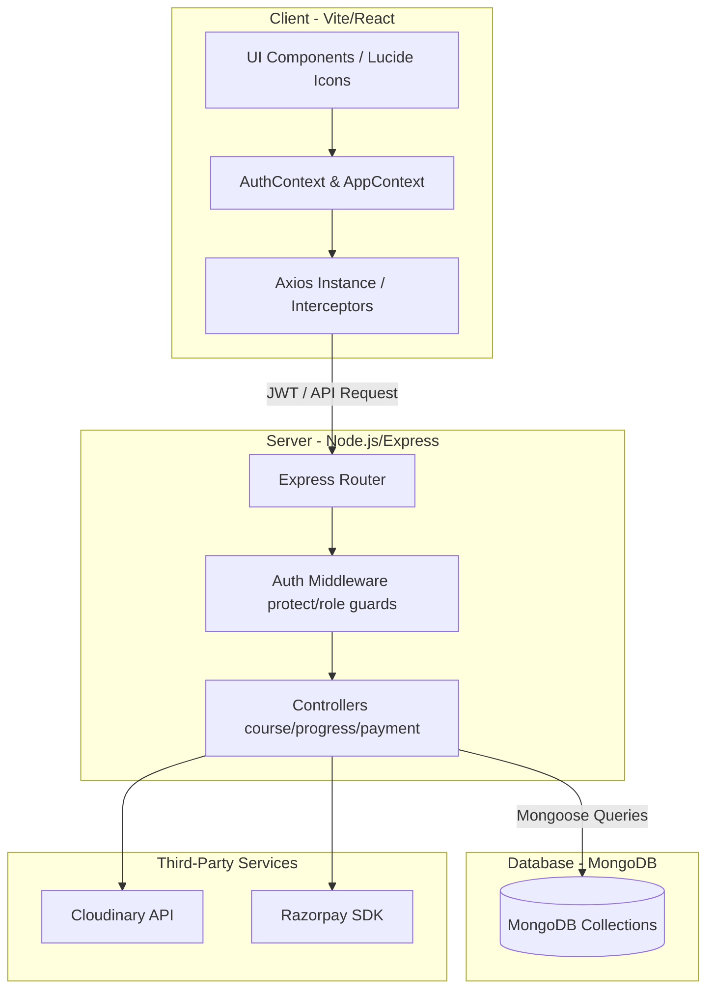
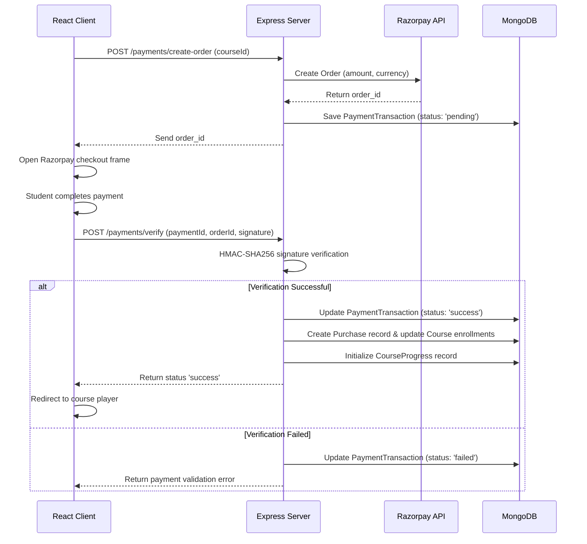

# VidyaTrack — Comprehensive SDE Frontend Interview Guide

This document provides technically rigorous, evidence-based answers to 30 deep interview questions about the **VidyaTrack** platform, focusing on the frontend architecture, performance optimizations, security paradigms, state management, and real-world trade-offs.

---

## Section A: Project Understanding & Architecture

### 1. Tell me about VidyaTrack. What problem does it solve, who are its users, and what was your specific contribution?
* **Core Product**: VidyaTrack is an enterprise-grade Learning Management System (LMS) combined with a resume builder and portfolio manager. Unlike standard educational platforms, it connects learning progress directly to career readiness.
* **The Problem**: 
  1. Traditional LMS platforms offer rigid, non-exportable progress trackers that students cannot leverage to demonstrate skill development to recruiters.
  2. Educators lack programmatic progress-verification mechanisms and clear, granular metrics regarding content engagement.
* **Target Audience**: 
  * **Students**: Seek a structured learning path with verifiable course completions and a CV-builder to export ATS-compliant resumes containing their real progress.
  * **Educators**: Require tools to publish video-based content, track student enrollment, and evaluate engagement metrics.
* **My Specific Contributions**: 
  1. Built the role-switching flow and authentication guards using custom session scoping.
  2. Implemented the course progress player incorporating the YouTube IFrame API with custom watch-time polling and 80% auto-completion.
  3. Engineered the ATS Resume Builder utilizing debounced local storage persistence and a manual coordinate-based PDF generation engine.
  4. Designed the UI skeleton loading system with CSS shimmer keyframes.

---

### 2. Why did you decide to build VidyaTrack? What gap did you identify in existing educational platforms?
* **The Gap**: Most online learning portals (e.g., Udemy, Coursera) keep course progress isolated. The student has no clean way to showcase skill acquisition other than a static certificate.
* **The Innovation**: VidyaTrack acts as an LMS that bridges learning data directly into a resume builder. It exports verifiable skills, course modules, and project work directly from the database into an ATS-friendly format.
* **Strategic Justification**: 
  * Providing a resume builder directly inside an LMS increases platform stickiness.
  * Educators gain credibility because the platform outputs validated accomplishments rather than unverified self-reporting.

---

### 3. Explain the complete architecture of VidyaTrack from frontend to backend to database.

* **Frontend**: Built with React (Vite). CSS styling is done using custom Tailwind utility classes. Navigation uses `react-router-dom` with private route wrappers. 
* **Backend**: Express.js server structured around an MVC (Model-View-Controller) design pattern. Custom middlewares validate JWT payloads and control user access at the route level.
* **Database**: MongoDB utilizing Mongoose schemas to represent Users, Courses, Purchases, and CourseProgress documents.
* **External Integrations**:
  * **Razorpay**: Used for course payments.
  * **Cloudinary**: Handles document uploads (resume verification files / educator application documents).

---

### 4. Why did you choose the MERN stack for this project? What alternatives did you consider?
* **MERN Advantages**:
  1. **Single-Language Development**: Standardizing on JavaScript/TypeScript from database schemas (Mongoose) to client-side components (React) reduces cognitive load and allows sharing validation rules (e.g., regex checks for email format).
  2. **JSON-Native Data Stream**: MongoDB stores data as BSON, which aligns with JSON representations in Express and React. No complex object-relational mapping (ORM) translations are required.
  3. **High Render Velocity**: React's virtual DOM is ideal for highly dynamic pages like the video player, resume editor steps, and responsive dashboard toggles.
* **Alternatives Considered**:
  * *Django + PostgreSQL*: Django provides robust administrative tools, but PostgreSQL’s rigid relational schema makes storing highly nested, variable course content (flexible chapters with varying lecture arrays) more cumbersome than MongoDB's document-model approach.

---

### 5. Your project has separate student and educator experiences. How did you structure the application to support these two roles without duplicating a lot of code?
* **Unified Database Model**: Instead of creating separate collections for Students and Educators, we use a single `User` model containing a `role` field ('user', 'educator', 'admin') and an `activeRole` field ('user', 'educator').
* **Session Scoping & Role Switching**: To prevent dual-privilege access, we implement a strict role-switching mechanism in `client/src/pages/RoleSwitchConfirm.jsx`:
  1. Upon role switch, the frontend terminates the active session by calling `logout()`.
  2. The user is redirected to the login view with a query parameter (e.g., `/login?role=educator`).
  3. Re-authentication is required, and the backend issues a fresh JWT containing only the claims scoped for the selected active role.
* **Code Reusability**: Shared components (like `Navbar.jsx`, `Skeleton.jsx`, and custom buttons) are configured dynamically using props (e.g., rendering distinct options depending on the `activeRole` from `useAuth()`).

---

## Section B: React / Frontend — High Probability

### 6. Why did you choose React for VidyaTrack? What advantages did React provide for this particular application?
* **Component-Driven UI**: Views like the Course Player (`Player.jsx`) and Resume Builder (`ResumeBuilder.jsx`) are broken down into sub-components (`StepPersonal`, `PreviewPanel`, `ScoreRing`) that reuse state managers.
* **State Synchronization**: React handles rendering updates smoothly. When a lecture is marked complete, the global `CourseProgress` state updates, recalculating chapter times, progress percentages, and unlocking certificate modules without a full page reload.
* **Ecosystem Integration**: Made full use of React’s library ecosystem, notably `react-router-dom` for SPAs, Lucide Icons, and Framer Motion for UI micro-animations.

---

### 7. How did you divide your VidyaTrack frontend into components? Give examples of reusable components you created.
* **Hierarchy**: Organized under `client/src/` as:
  * `/components/student/` and `/components/educator/` for domain-specific components.
  * `/components/auth/` for routers/gatekeepers.
  * `/components/skeleton/` for visual loading primitives.
* **Key Reusable Component Examples**:
  1. **Skeleton Primitives (`client/src/components/skeleton/Skeleton.jsx`)**: Implements base shimmer primitives like `SkeletonText`, `SkeletonAvatar`, and full page blueprints (`SkeletonPlayer`, `SkeletonEducatorDashboard`) using `React.memo` to prevent unnecessary re-renders.
  2. **Navbar (`client/src/components/student/Navbar.jsx`)**: Evaluates role contexts (`isActiveEducator`, `activeRole`) and dynamically changes layout, menus, mobile drawers, and route access flags.

---

### 8. How did you manage state in the application? Which state was local, which was global, and why?
* **Local State (`useState` / `useRef`)**:
  * Used for UI-specific values (e.g., menu open flags, active inputs, validation error objects, and video playback references).
  * In the Resume Builder (`ResumeBuilder.jsx`), each form step uses local variables, which are synced back to the master object via `updateField` callbacks.
* **Global State (React Context)**:
  * **AuthContext (`client/src/context/AuthContext.jsx`)**: Stores the active user object, authentication flags, active token scopes, and manages the role switching and login processes.
  * **AppContext (`client/src/context/AppContext.jsx`)**: Holds global course lists, active enrollments, and utility methods like course time duration calculations.

---

### 9. Suppose a student increases the quantity of an item/resource in the UI. How do you ensure that only the required part of the UI updates instead of unnecessarily re-rendering the entire page?
* **State Isolation**: Ensure the item quantity is stored locally within an isolated child component (e.g., a `ResourceRow` or `CartItem`). When the local state changes, only that component re-renders.
* **Key Properties**: Always assign unique, stable `key` attributes (like `item._id` from MongoDB) instead of index values when rendering lists. This helps React's reconciliation engine identify exactly which DOM nodes need modification.
* **Memoization**: Wrap stateless child cards in `React.memo`. Use the `useCallback` hook on click handler functions passed to child components to maintain referential equality and prevent re-rendering.

---

### 10. How did you handle API calls from React? Where did you keep the API logic, and how did you handle loading, success, and error states?
* **Centralization**: All API operations are isolated in `client/src/services/api.js`. This module instantiates a configured Axios client:
  ```javascript
  const api = axios.create({ baseURL: import.meta.env.VITE_BACKEND_URL });
  ```
* **Request Interceptor**: Automatically attaches the authorization bearer token if it exists:
  ```javascript
  api.interceptors.request.use((config) => {
      const token = localStorage.getItem('token');
      if (token) config.headers.Authorization = `Bearer ${token}`;
      return config;
  });
  ```
* **State Management in Pages**:
  * **Loading**: Managed via `loading` state variables that swap components with `<SkeletonPlayer />` or `<SkeletonCourseDetail />`.
  * **Success/Error**: Managed via `try-catch` structures. On success, states update; on failure, errors are printed to console and displayed via `react-toastify`.

---

### 11. How did you handle navigation between different pages and dashboards? How did you prevent unauthorized users from accessing protected routes?
* **Protected Routes (`client/src/components/auth/ProtectedRoute.jsx`)**:
  * Routes are wrapped using a guard component that evaluates claims:
    ```javascript
    if (!isAuthenticated()) return <Navigate to="/login" replace />;
    if (requireEducator && !isEducator()) return <Navigate to="/" replace />;
    ```
* **Axios Interceptor Guard**: If a request returns a `401 Unauthorized` status (e.g., token expired), the Axios response interceptor triggers `logout()` and redirects the user to the login screen:
  ```javascript
  api.interceptors.response.use(
      response => response,
      error => {
          if (error.response?.status === 401) {
              localStorage.removeItem('token');
              window.location.href = '/login';
          }
          return Promise.reject(error);
      }
  );
  ```

---

### 12. Explain the lifecycle of a user action in VidyaTrack—for example, a student enrolling in a course—from clicking the button in React until the data is persisted in MongoDB.
1. **User Action**: Student clicks the "Enroll Now" button on the Course Detail view.
2. **API Order Creation**: The frontend triggers `apiService.payments.createOrder(courseId)`. The backend creates a Razorpay transaction order and saves it to MongoDB in the `PaymentTransaction` collection as `status: 'pending'`.
3. **Razorpay Dialog**: The backend returns the `orderId`. The client-side Razorpay SDK opens the checkout modal.
4. **Payment Completion**: The student completes payment. Razorpay returns payment metadata (`paymentId`, `signature`).
5. **Frontend Verification Request**: The client sends this metadata to the backend endpoint `/api/payments/verify`.
6. **Signature Check**: The backend verifies the HMAC signature using the local secret key.
7. **Purchase Fulfill**: If valid, the backend updates the transaction status to `'success'`, inserts a new document into the `Purchase` collection, updates the course document's enrollment array, and initializes a new `CourseProgress` tracker.
8. **UI State Sync**: The backend returns a success response. The client updates global dashboard states and routes the user directly to `/player/:courseId`.

---

## Section C: Authentication & RBAC

### 13. Explain how authentication works in VidyaTrack from login to accessing the dashboard.
1. **Credentials Dispatch**: The user submits their email and password through `client/src/components/auth/Login.jsx`, selecting their target role ('student' or 'educator').
2. **Backend Authentication**: The backend locates the user document, verifies the password hash using `bcryptjs`, updates the `activeRole` in MongoDB to match the selected role, and generates a JWT.
3. **Claims Structure**: The JWT payload contains:
   ```json
   { "id": "userId", "role": "user|educator|admin", "activeRole": "user|educator" }
   ```
4. **Token Storage**: The client stores the token in `localStorage` and updates the React state inside `AuthContext`.
5. **Dashboard Access**: The user is navigated to the dashboard. The `ProtectedRoute` verifies the client token's active claims, and the Axios interceptor appends the token to all outgoing API calls.

---

### 14. How did you implement role-based access control for students and educators?
* **Database Representation**: The `User` schema contains roles that define access limits.
* **Token Claims**: Roles are encoded in the JWT claims payload upon authentication.
* **Route Middleware Guards**: Endpoints are protected by specialized middleware handlers in `server/middlewares/authMiddleware.js`:
  * **protectStudent**:
    ```javascript
    if (req.user.activeRole !== 'user') return res.status(403).json({ message: "Student access required" });
    ```
  * **protectEducator**: Checks both db role and approval flags:
    ```javascript
    if (req.user.role !== 'educator' || !req.user.educatorApproved || req.user.activeRole !== 'educator') {
        return res.status(403).json({ message: "Educator access denied" });
    }
    ```

---

### 15. Why shouldn't frontend-based role checking alone be considered secure?
* **Client-Side Alteration**: JavaScript code executed in the browser can be manipulated. A user can change React variables in the console or patch memory state to bypass route guards (e.g., mapping `<ProtectedRoute>` properties directly to `true`).
* **Source Exposure**: Production bundles contain build code. If API endpoints are not guarded by backend session verification, a user can inspect the network requests and execute raw API calls (via tools like Postman) using their standard student token.
* **Defense in Depth**: Frontend checks are for UX layout optimization. Security must always be enforced on the backend server by validating signed cryptographically secure tokens.

---

### 16. Suppose a student manually changes the URL from /student/dashboard to /educator/dashboard. What happens in your application?
1. **Frontend Interception**: The `react-router-dom` router captures the navigation request.
2. **Guard Evaluation**: The router checks the configuration for `/educator/dashboard`, which is wrapped in a `<ProtectedRoute requireEducator={true}>` guard.
3. **Conditional Redirect**: The guard evaluates the active role claim in `AuthContext`. Since `isEducator()` is false, the component intercepts the render path and returns `<Navigate to="/" replace />`, redirecting the student back to the home page.
4. **API Safety**: Even if the student attempts to manually render the HTML structure, the view will try to fetch dashboard analytics. The backend API request will return a `403 Forbidden` response because the JWT does not contain the required educator claims, preventing any data leak.

---

### 17. How would you prevent a malicious user from directly calling an educator-only API even if they bypass the frontend?
* **JWT Verification**: Every API route uses the `protect` middleware which decodes the header payload and verifies the cryptographic signature against the environment variable `JWT_SECRET`.
* **Middlewares enforce RBAC**: The request must pass the `protectEducator` middleware check. This middleware queries MongoDB to verify the user is an approved educator and checks that `activeRole` is set to `'educator'`.
* **Database Isolation**: Queries are scoped to the user ID extracted directly from the decrypted token payload (`req.user._id`), not values sent in the query parameters.

---

## Section D: Backend / API Integration

### 18. Explain the REST APIs you developed for VidyaTrack. What were the major resources or endpoints?
The backend exposes resources structured around standard REST principles:
* **Authentication (`/api/auth`)**:
  * `POST /login` - User login and active-role token generation.
  * `POST /signup` - Student account registration.
* **Courses (`/api/courses`)**:
  * `GET /` - Public catalog retrieval.
  * `POST /create` - Educator course publishing.
  * `GET /enrolled/:courseId` - Retrieve enrolled course curriculum details (protected).
* **Course Progress (`/api/progress`)**:
  * `GET /:userId/:courseId` - Retrieve progress maps (completed lectures and timestamps).
  * `POST /update` - Mark specific lectures as complete.
* **Payments (`/api/payments`)**:
  * `POST /create-order` - Create order transaction ID.
  * `POST /verify` - Complete signature checks and process enrollments.

---

### 19. How did you structure your Express.js backend? How did you separate routes, controllers, business logic, and database operations?
We follow the Model-View-Controller (MVC) design pattern:
1. **Entry Point (`server.js`)**: Connects databases, configures global Express middlewares (CORS, JSON parsers), and mounts routers.
2. **Routes Directory (`server/routes/`)**: Map URI patterns to controller handlers and register middleware chains (e.g., validation checks, auth guards):
   ```javascript
   router.post('/update', protect, protectStudent, updateLectureProgress);
   ```
3. **Controllers (`server/controllers/`)**: Parse HTTP headers/body parameter payloads, orchestrate logic flow, and return responses.
4. **Models (`server/models/`)**: Define the Mongoose schemas and indexes that map to the MongoDB database collections.

---

### 20. How did you validate data coming from the frontend before storing it in MongoDB?
* **Frontend Pre-Validation**: Built input checkers into components. For example, in the Resume Builder, `validateStep` executes schema checks on the current step state before allowing navigation to the next section.
* **Mongoose Schema-Level Validations**: Database schemas enforce validation rules:
  ```javascript
  email: {
      type: String,
      required: true,
      unique: true,
      match: [/.+\@.+\..+/, 'Please fill a valid email address']
  }
  ```
* **Express Controller Validation**: Before database writes, controllers execute conditional payload checks to verify arrays are not empty and numeric parameters fall within acceptable bounds.

---

### 21. What happens when the backend API fails while the user is performing an important operation? How does your frontend handle that failure?
* **Optimistic UI Updates with Rollback**: For highly interactive updates (like marking a lecture complete in `Player.jsx`), the application updates the UI state immediately:
  1. It performs an optimistic update of the local completion map and writes to `localStorage`.
  2. It dispatches the network request in the background.
  3. If the request fails, the application catches the error, reverts the states and `localStorage` back to their previous values, and displays a warning toast using `react-toastify`.
* **Global Error Interceptors**: The centralized Axios configuration catches general server errors (like `500 Server Error` or database timeouts) and alerts the user with friendly notifications, rather than crashing the React application.

---

## Section E: Razorpay / Payments

### 22. You mentioned Razorpay integration. Explain the complete payment flow in VidyaTrack.


---

### 23. Why can't you simply trust the payment-success response coming from the frontend?
* **Tampering Exposure**: Frontend code runs in a client environment where network requests can be modified. A user could intercept the network traffic and simulate a successful payment API call to grant themselves free course access.
* **Verifiability**: The checkout modal is rendered in the client browser. Successful completion events generated by the client UI only mean the payment gateway completed the interface flow; it does not confirm the payment has cleared in the vendor account.
* **Server Verification Necessity**: Validating the payment server-side ensures the cryptographic signature matches the transaction parameters, protecting the system from enrollment fraud.

---

### 24. How would you verify that a payment was genuinely completed before granting a student access to a paid course?
1. **Cryptographic Signature Verification**:
   When a payment completes, Razorpay returns an `order_id`, `payment_id`, and a secure `signature`.
   The backend uses these values to calculate a local signature using the Razorpay API secret key:
   ```javascript
   const crypto = require('crypto');
   const generatedSignature = crypto
       .createHmac('sha256', process.env.RAZORPAY_KEY_SECRET)
       .update(orderId + "|" + paymentId)
       .digest('hex');
   ```
2. **Signature Match**: If the calculated signature matches the returned signature, the transaction is verified.
3. **Database Guard Rails**: Access is granted only after this verification succeeds.

---

## Section F: Performance / UI / UX

### 25. What were the major performance problems you encountered in VidyaTrack, and how did you solve them?
* **YouTube Player API Overhead**:
  * *Problem*: Rerendering the course player triggered repeated script downloads of the YouTube IFrame library.
  * *Solution*: Built a singleton loader pattern (`Player.jsx`) that checks the document script tags and loads the YouTube library only once.
* **Debounced Form Persistence**:
  * *Problem*: The resume builder's autosave feature caused high disk write operations by updating local storage on every keystroke.
  * *Solution*: Implemented a 500ms debounce timer inside `ResumeBuilder.jsx`'s update hook.
* **Custom PDF Canvas Overhead**:
  * *Problem*: Rendering large document trees via `html2canvas` resulted in blurry text and large PDF file sizes.
  * *Solution*: Replaced the canvas approach with direct `jsPDF` vector coordinate drawing, producing crisp, scalable text paths and keeping exported file sizes small (~10KB).

---

### 26. How did you make VidyaTrack responsive across different screen sizes?
* **Mobile-First Breakpoints**: Used Tailwind CSS responsive variants (e.g., `sm:`, `md:`, `lg:`, `xl:`) to adjust interface layouts on larger screens.
* **Fluid Grids & Flexbox**: Layouts use relative sizes (like `w-full md:w-3/4`) and CSS Grid structures (like `grid-cols-1 md:grid-cols-3`) to handle different viewport aspect ratios automatically.
* **Adaptive Components**: Sidebar navigation drawers use off-canvas transitions driven by React state toggles, maintaining access to dashboard menus on smaller screen sizes.

---

### 27. Why did you choose Tailwind CSS? What advantages did it provide compared with conventional CSS or another styling approach?
* **Design Speed**: Styling is done by adding classes directly within React markup, eliminating the need to jump between `.jsx` and external stylesheet files.
* **Design System Consistency**: Tailwind's configuration defines consistent typography sizing, color palettes, and spacing rules, which prevents custom styling variations.
* **Performance**: The Tailwind build tool parses markup during packaging and compiles only the utility classes actually used in the UI, keeping the final CSS bundle size small.

---

### 28. If VidyaTrack suddenly had 100,000 students, what frontend problems would you expect, and what would you change to handle that scale?
* **Heavy DOM Rendering**:
  * *Problem*: Rendering thousands of courses in list pages would degrade performance and increase browser memory usage.
  * *Solution*: Implement virtual lists or windowing (using libraries like `react-window` or `react-virtualized`) to render only the elements currently visible in the user's viewport.
* **Data Fetching Overhead**:
  * *Problem*: Fetching whole catalogs repeatedly would put a high load on the backend.
  * *Solution*: Introduce pagination and client-side caching (using libraries like React Query or SWR) to cache API responses and fetch data in chunks as needed.
* **Asset Loading Bottlenecks**:
  * *Problem*: Large bundle files and high-resolution course images would cause slower load times for users.
  * *Solution*: Split code bundles using dynamic imports (`React.lazy`), compress image files, and distribute assets through a Content Delivery Network (CDN).

---

## Section G: Deep Follow-ups / Engineering Judgment

### 29. If I give you one month to improve VidyaTrack for production, what three technical improvements would you make first, and why?
1. **Migration to Next.js**:
   * *Rationale*: Migrating to Next.js provides Server-Side Rendering (SSR). This improves search engine indexing (SEO) for public course catalog pages and speeds up initial page load times.
2. **Robust State Caching with React Query**:
   * *Rationale*: Replacing standard React Context API fetching with React Query provides built-in pagination, automatic cache invalidation, and data prefetching.
3. **Comprehensive Testing Suite**:
   * *Rationale*: Add unit testing (using Jest) and integration testing (using Cypress) to verify critical parts of the application, such as role-switching actions and checkout procedures.

---

### 30. Looking back at the project, what is one technical decision you would change if you rebuilt VidyaTrack today?
* **The Decision**: Building the custom PDF generation logic using direct coordinates in `jsPDF`.
* **The Challenge**: While coordinate drawing (`doc.text(text, x, y)`) produces clean vector text paths and small file sizes, it requires manual calculations for line wrapping and page margins, making UI styling changes difficult to maintain.
* **The Solution**: Today, I would use `@react-pdf/renderer`. It allows styling layout designs directly using a declarative flexbox markup structure and renders the PDF output on the client side, combining clean formatting with easier maintenance.
